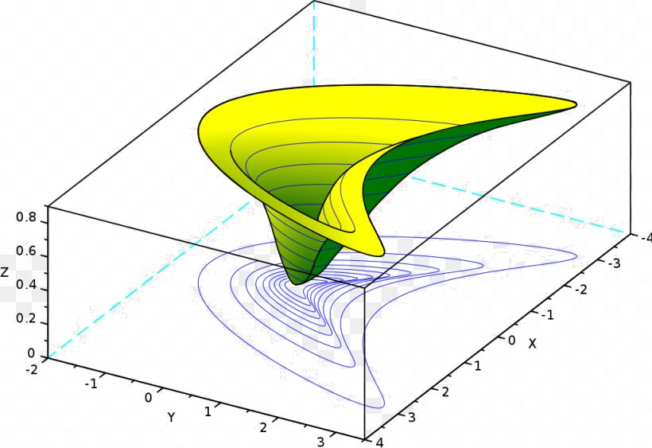
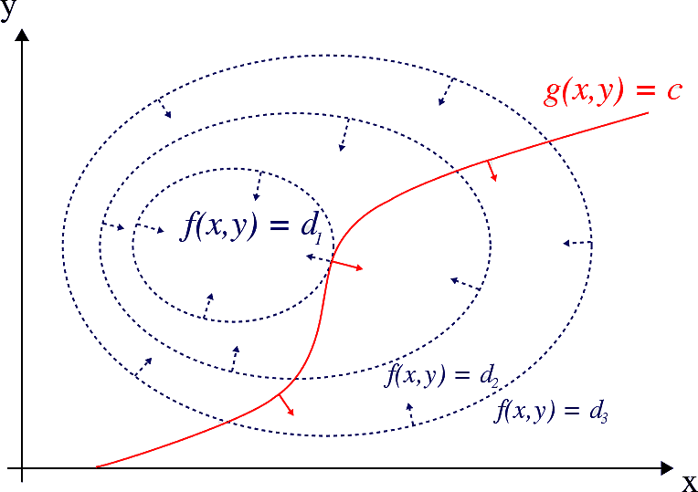
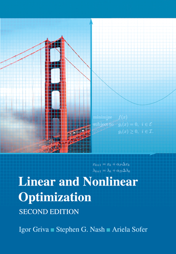

Welcome to the homepage of **Math F661 Optimization**, Fall 2022, in the [Dept. of Mathematics and Statistics](http://www.uaf.edu/dms/) at the [University of Alaska Fairbanks](http://www.uaf.edu/).

#### Instructor:  [Ed Bueler](http://bueler.github.io/)

Email me at [elbueler@alaska.edu](mailto:elbueler@alaska.edu).  I hold [office hours](http://bueler.github.io/OffHrs.htm) in Chapman 306C.

### [Canvas course page](https://canvas.alaska.edu/courses/9948)

Log in to [canvas.alaska.edu/courses/9948](https://canvas.alaska.edu/courses/9948) for Homework and Exam solutions, and to see your grades.

### Getting Started

* Read the [Syllabus](assets/general/syllabus.pdf).

* See the [Schedule](assets/general/schedule.pdf).  Check it often for due dates, and for which topics come next!

* Check out the weekly [homework Assignments](homework.html).  These require some programming in Matlab/Octave or another scientific computing language on every assignment and on the project.  See [_Programming languages compared_](https://bueler.github.io/compareMOP.pdf) for recommended languages.

* You will do a [two-part project](project.html) on a topic of your choice.  See the [Project](project.html) tab for details.

* There are [two Exams](exams.html), a Midterm and a Final.  Both are in class, and the Final will happen at the scheduled time (Friday, December 16, 3:15pm--5:15pm).  See the [Exams](exams.html) tab for the sections covered, and old exams for review.

 &nbsp; &nbsp;  &nbsp; &nbsp; 

* See the one-page [advertisement](assets/general/advert.pdf) for this course.

---
_Site design derived from [coordinated Calc I](https://uaf-math251.github.io/), an original [Jekyll](https://jekyllrb.com/) design by [David Maxwell](https://damaxwell.github.io/)._

